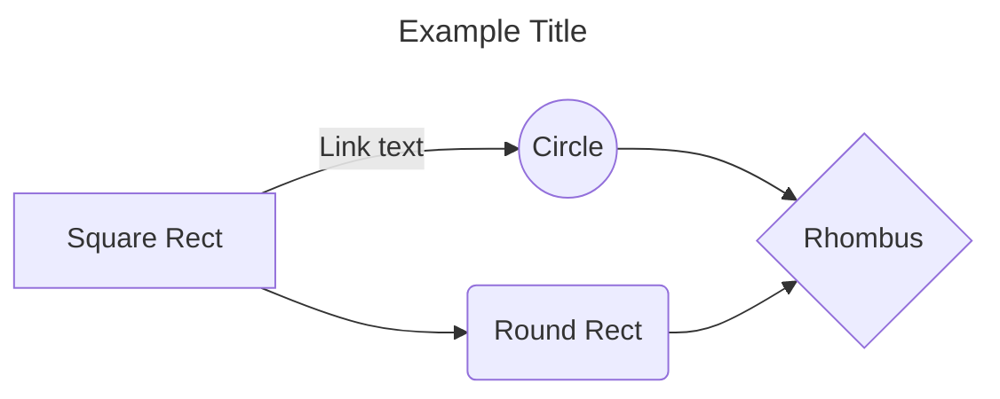
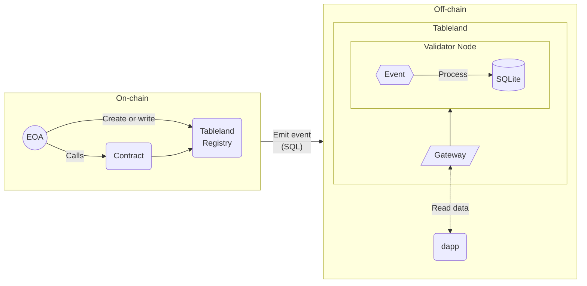

The docs site is built using Docusaurus, a static site generator developed by Meta that is specifically designed for documentation. It offers a number of features, including MDX support (embed JSX in markdown) and various content-friendly plugins. Please ensure you follow the guidelines on writing style as well.

## Front matter

Every markdown page should include [front matter](https://docusaurus.io/docs/next/markdown-features#front-matter) at the beginning of the document, which should be valid YAML and between triple dashed lines (`---`). This information is used in the content itself, page routes, and to generate site metadata (for [SEO](https://docusaurus.io/docs/next/seo)). Every page should include a `title`, `description`, and (often) `synopsis` since these are used when generating the page's content. For example, this page has the following front matter:

```md
---
title: Style guide
description: Learn the ins and outs of contributing to the Tableland docs site.
keywords:
  - docs
  - tableland
  - contribute
  - contributor
  - contributing
tags:
  - contributing
---
```

These fields can also be referenced within the page itself using JSX, such as `{frontMatter.description}`, and custom front matter can also be set; these can only be accessed in a page's content if wrapped in html elements.

You'll notice only a few are commonly used, and the full list can be found [here](https://docusaurus.io/docs/next/api/plugins/@docusaurus/plugin-content-docs#markdown-front-matter):

<!-- prettier-ignore -->
| Variable | Description |
| -------- | ----------- |
| `title`  | The page's title gets automatically displayed in the content as a primary header at the top (`# Your Title`) and is also used in the page's metadata. It **should always** be included since this value is used in the sidebar as well as displayed at the top of the page. |
| `description`| A brief about the page, kept to around 60 to 120 characters (a sentence). This **should always** be included since it is displayed on the page at the top (under the main title), and it is also used in page metadata.
| `keywords`| _(Optional)_ Keywords help with SEO and are part of the page's metadata. Simply add a bulleted list of keywords, or provide an array of comma-separated values (e.g., `keywords: [docs, tableland]`).
| [`tags`](https://docusaurus.io/docs/next/create-doc#doc-tags)| _(Optional)_ Similarly, tags help with categorization and search within the site. Simply add a bulleted list of tags, or provide an array of comma-separated values (e.g., `tags: [docs, tableland]`). These are displayed at the bottom of each page, and viewing a grouping is possible by clicking on the tag or visiting the `/docs/tags` URI on the site.
| `sidebar_label`| _(Optional)_ A page's `title` can have a different display value in the sidebar. For example, this page has a title of `How to contribute` but a `sidebar_label` of `Contributor guidelines`. Often, this field is used for long page titles that should be condensed within the sidebar section.
| [`id`](https://docusaurus.io/docs/next/create-doc#document-id)| _(Optional)_ Each docuement has a unique ID generated based on the file path from the root `docs` directory. For example, an `example` folder within the `docs` directory that contains `test.md` with have an auto-generated `id` of `example/test`. The ID is used to refer to a document when hand-writing sidebars, or when using docs-related layout components or hooks. Thus, it is generally okay to use the auto-generated `id`.
| [`slug`](https://docusaurus.io/docs/next/create-doc#doc-urls)| _(Optional)_ The default slug will be the file path. For example, an `example` folder within the `docs` directory that contains `test.md` with have a slug `docs/example/test`. Instead, you can set a custom slug. If you set the `slug` to `my-new-slug`, the slug will now be `docs/example/my-new-slug` (`docs/my-new-slug`) or a specific name (`docs/specific-name/my-new-slug`). Generally, you can expect to use the default behavior.
| `image`| _(Optional)_ A thumbnail image to be shown in social media cards. A default image is configured such that this is not required, unless desired by the page creator (e.g., a custom tutorial or a page with tailored imanges already present).
| `hide_title`| _(Optional)_ A boolean value can be passed to hide the default `title`. This is only really used in case of an imported markdown file that begins with a `#`, which should then be used as the page's `title`. In other words, only use this if for some reason, you need to hide the first `#` of some imported markdown file.
| `sidebar_position`| _(Optional)_ This should not be used in these docs because the sidebar ordering is managed in a `sidebars.js` configuration file. But, for any autogenerated sidebars, you can have the ordering defined in the front matter to ensure sidebar ordering is not simply alphatbetical filenames.

## Page headings

All headings / titles should follow sentence case. Namely, do not capitalize the page like a title but as a sentence. As an example, this page's primary heading is `How to contribute` and **_not_** `How to Contribute`. Research suggests that sentence case is more readable, and [Stripe's best-in-class docs](https://stripe.com/docs/stripe-cli) do the same.

Also, the primary headings in markdown (`#`) are reserved for the page's title. You **should not use `#` in your markdown pages**. Instead, all headings must be a secondary (`##`) or smaller. If a primary heading is used, the header content will not render in the table of contents on the right-hand side. One other potentially useful customization is redefining heading anchor links—perhaps if a header is too verbose, you can customize it: `## Hello {#my-custom-id}`. These docs allow for three levels of nesting to show up in the table of contents: `h2`, `h3`, or `h4`.

Note that using an `h1`, `h2`, etc. _within markdown_ will not render in the table of contents. These elements can be used as needed. All markdown headings (`#`, `##`, etc.) _will_ render in the table of contents, and for reference, these are later compiled into html elements when the docs site is built.

## Writing style

For most of the documentation, writers should address the user directly with (e.g., "you") but never use first person ("I" or "me"). Tutorials are an exception where first person _plural_ (e.g., "we") can be used since it is a guiding experience _with_ the audience. Some other key points:

- Get to the point. Docs are meant to quickly explain how to do something.
- The language should resemble your spoken voice and not sound robotic.
- When in doubt, don't capitalize (i.e., sentence-style capitalization).
- Use the [Oxford comma](https://en.wikipedia.org/wiki/Serial_comma).
- End all sentences with a period; headings should not end in punctuation.
- When using the em dash (—), don't put spaces around it but "connected" to the word(s) its between.

Feel free to refer [Google's style guide](https://github.com/google/styleguide/blob/gh-pages/docguide/style.md) as well as [Microsoft's](https://docs.microsoft.com/en-us/style-guide/welcome/) for more pointers.

## Templates

This project places a number of starter templates in the `docs/_templates` directory. Note that any directory that is prefixed with an underscore `_` **will not be** indexed nor displayed on this site. Instead, go to the [docs GitHub repo](https://github.com/tablelandnetwork/docs/tree/main/docs/_templates) to see this content.

Generally, every category should have a similar structure inclusive of the following pages:

1. Overview
2. Get started
3. Additional pages with specific content
4. FAQs

This is a general framework but not explicitly required. If there are multiple subcategories, each should include points `2.` and `3.` above. A good example to reference is the [Stripe developer docs](https://stripe.com/docs/stripe-cli).

## MDX

[MDX (v1)](https://docusaurus.io/docs/markdown-features/react) is a superset of markdown that adds the ability to import and use JSX alongside common markdown; execute code blocks inside markdown. You can write your own components within `src/components` and then import them into the desired markdown page, or write them directly in an page (**must** use `export`):

```jsx
export const Element = ({ word }) => <h4>Hello, {word}!</h4>;

<Element word={"world"} />;
```

export const Element = ({ word }) => <h4>Hello, {word}!</h4>;

This will render the following JSX within the markdown:

<Element word={"world"} />

You can also import markdown files into another markdown file. Here's a simple example using the `@site` keyword to denote the root folder (but, of course, relative paths can also be used). It may occasionally be helpful to use the `hide_title` front matter, in case the imported markdown already beings with an `h1` (`#`) tag:

```md
---
hide_title: true
---

import DataTypes from '/sql/specification/DataTypes.md'

<DataTypes />
```

Docusaurus also offers a set of components that can be imported into markdown, such as `Tabs`. Note that Docusaurus parses both `.md` and `.mdx` files using MDX, but some of the syntaxes are treated slightly differently by third-party tools. Thus, an `.md` file can leverage `.mdx` functionality but beware that third-party tools may not do the same—a best practice is to use `.mdx` where JSX is used. See [here](https://docusaurus.io/docs/markdown-features/react) for more details.

## Code blocks

Annotating a code block with the file name or highlighting specific lines is possible using the built-in [code block](https://docusaurus.io/docs/markdown-features/code-blocks) feature. For example, here is a snippet from a named file (place the named `title` in the starting ` ``` ` line) that also highlights multiple lines using [magic comments](https://docusaurus.io/docs/markdown-features/code-blocks#custom-magic-comments) with `// highlight-next-line` or `// highlight-start` + `// highlight-end`.

````md
```js title="/src/components/Hello.js"
function HighlightSomeText(highlight) {
  if (highlight) {
    // highlight-next-line
    return "This text is highlighted!";
  }
  // highlight-start
  return "This is also highlighted!";
  // highlight-end
}
```
````

This will then show the file name at the top of the code block, plus, the specific highlighted lines:

```js title="/src/components/Hello.js"
function HighlightSomeText(highlight) {
  if (highlight) {
    // highlight-next-line
    return "This text is highlighted!";
  }
  // highlight-start
  return "This is also highlighted!";
  // highlight-end
}
```

Alternatively, the range syntax `{}` can be used within the meta string. For example, `{3-4,7}` will include lines 3 to 4 and line 7); be sure to _not_ include spaces (i.e., `{3-4, 7}` will not work, but `{3-4,7}` will). Another optional flag is `showLineNumbers` to show the code's line numbers.

````md
```js title="/src/components/Hello.js" {3-4,7} showLineNumbers
function HighlightFromMetaString(highlight) {
  if (highlight) {
    console.log("highlight me");
    return "This line is highlighted!";
  }

  return "I'm also highlighted!";
}
```
````

Renders:

```js title="/src/components/Hello.js" {3-4,7} showLineNumbers
function HighlightFromMetaString(highlight) {
  if (highlight) {
    console.log("highlight me");
    return "This line is highlighted!";
  }

  return "I'm also highlighted!";
}
```

Lastly, display an error message (highlight with red) on the subsequent line with the `// error` comment.

````md
```js
const name = null;
// error
console.log(name.toUpperCase());
// Uncaught TypeError: Cannot read properties of null (reading 'toUpperCase')
```
````

This will highlight the line where the error "occurs":

```js
const name = null;
// error
console.log(name.toUpperCase());
// Uncaught TypeError: Cannot read properties of null (reading 'toUpperCase')
```

import { SupportedChains, ChainsList, ChainInfo } from '@site/src/components/SupportedChains'

## Components

There are a few custom components that can be imported and used in markdown. For example, you can use `<ChainsList />`, `<ChainInfo />`, `<SupportedChains />` etc. to render content in markdown. The components can be found in the `/src/components` directory of the docs site.

```js
import { ChainsList, ChainInfo, SupportedChains } from '@site/src/components/SupportedChains'

<ChainsList type={'testnets'} format={'string'} />

<ChainsList type={'mainnets'} format={'list'} />

<ChainInfo chain='sepolia' info='chainId' />

<SupportedChains />
```

The `<ChainsList />` will render a string (aka it renders: <ChainsList type={'testnets'} format={'string'} />) or a list of chains:

<ChainsList type={'mainnets'} format={'list'} />

And `<ChainInfo />` can render something like Ethereum Sepolia's chain ID: <ChainInfo chain='sepolia' info='chainId' />. If you want to access the raw data, you can use the exported `getChainInfo()` method, which `<ChainsList />` uses under the hood to render a `<span>` containing the data. And `<SupportedChains />` renders a table of chain values:

<SupportedChains />

## Links

You can use either a URL path (`./example`) or file path (`./example.md`); but, always opt for the extension-less import. If you're referencing another page, you can opt for a relative path such that it will be resolved against the current file's directory. And as with standard markdown, you can link to a heading within the page by referencing the heading in [kebab case](https://en.wikipedia.org/wiki/Letter_case#Kebab_case).

```md title="docs/folder/doc1.md"
## My page

I am referencing a [document](doc2.md). # This is also in the same `folder`

Reference to another [document in a subfolder](subfolder/doc3.md). # This is in `folder/subfolder`

[Relative document](../otherFolder/doc4.md) referencing works as well. # A document outside of `folder`

[A link to "My page"](#my-page)
```

## Admonitions

[Admonitions](https://docusaurus.io/docs/markdown-features/admonitions) are callout boxes with a keyword, symbol, and color. An example in this document is the tooltip at the top, which is generated using `:::` followed by the keyword `tip`, a custom title (optional), and later closed out by another `:::`:

```md
:::tip Your Title
This is a tip.
:::
```

Aside from `tip`, other options include `note`, `info`, `caution`, and `warning`. Each of these comes with a different color and symbol, and if no custom title is created, the callout's title will default to the captialized keyword name (`Tip`, `Note`, etc.).

Additionally, standard quotation blocks (starting a line with `>`) are displayed with a custom format. These may also be used to highlight specific information in scenarios that don't need the callout box with `:::tip`, etc. but want to highlight a block of text. Lastly, [`<details>`](https://developer.mozilla.org/en-US/docs/Web/HTML/Element/details) may occasionally be useful for a similar purpose.

## Tabs

Many code examples have multiple languages or commands that can be used for, essentially, the same thing. Perhaps a Node.js vs. client-side import or usage of installing with `npm` vs. `yarn`. With tabs, code can easily be displayed with a side-by-side navbar-like set of tabs that are used in a markdown files. Keep in mind that the MDX parser is rather picky, so **you must** provide the correct spacing and indentation for code blocks, as demonstrated below:

```md
import Tabs from "@theme/Tabs";
import TabItem from "@theme/TabItem";

<Tabs>
  <TabItem value="esm" label="Node.js (import)" default>

    import abc from "abc";

  </TabItem>
    <TabItem value="require" label="Node.js (require)">

    const abc = require("abc");

  </TabItem>
</Tabs>
```

Notice how the content in each tab didn't have a language specified (the `TabItem`'s `value` has no impact on language styles). If you want to add a language type or use the `title` or line highlighting feature, you need to make the tabs wrap code snippets.

````md
import Tabs from "@theme/Tabs";
import TabItem from "@theme/TabItem";

<Tabs>
<TabItem value="esm" label="Node.js (import)" default>

```js title="/src/components/Hello1.js"
import abc from "abc";
```

</TabItem>
<TabItem value="require" label="Node.js (require)">

```js title="/src/components/Hello2.js"
const abc = require("abc");
```

</TabItem>
</Tabs>
````

Note that `Tabs` and `TabItems` can be a little picky with spacing and return lines, so if something isn't rendering as expected, this could be the issue.

import Tabs from "@theme/Tabs";
import TabItem from "@theme/TabItem";

<Tabs>
<TabItem value="esm" label="Node.js (import)" default>

```js title="/src/components/Hello1.js"
import abc from "abc";
```

</TabItem>
  <TabItem value="require" label="Node.js (require)">

```js title="/src/components/Hello2.js"
const abc = require("abc");
```

</TabItem>
</Tabs>

You can alternatively pass `defaultValue` and an array of objects with keys `label` and `value` to `Tabs`:

```jsx
<Tabs
  defaultValue="bobby"
  values={[
    { label: "Bobby", value: "bobby" },
    { label: "Tables", value: "tables" },
]}>
```

### Package managers

Since `npm` and `yarn` are so commonly used, the [npm2yarn](https://www.npmjs.com/package/@docusaurus/remark-plugin-npm2yarn) plugin was made to handle this without the need for using tabs while also auto-generating a `yarn` command from an `npm` command:

````md
```terminal npm2yarn
npm run build
npm install <package>
npm run start
```
````

Which renders:

```terminal npm2yarn
npm run build
npm install <package>
npm run start
```

## Assets & images

All [static assets](https://docusaurus.io/docs/next/static-assets) should be placed in the `src/static/assets` directory, including images. Although it _is_ possible to reference images placed within the `docs` folder, it is not recommended for maintainability purposes. If you move a markdown page around, the image links will break, whereas placing them in `src/static` will ensure the path is fixed.

These files will be will be copied into the root of the generated `build` folder with the directory hierarchy preserved (e.g., some image `/static/assets/example-image.png` will be served at `/assets/example-image.png`).
Content, such as images, can be displayed directly through either markdown syntax, CJS require, ES imports syntax, or the built-in `useBaseUrl` method. SVGs can also be directly imported. The following demonstrate how to do this, and note the `@site` prefix can be used to access the root `src` directory:

```jsx
import useBaseUrl from "@docusaurus/useBaseUrl";
import myImage from "@site/static/assets/example-image.png";
import localDocsImage from "../some-relative-path-in-docs/dont-do-this-though.png";


<!-- Or, use standard markdown -->


```

Note the `localDocsImage` example is demonstrated, but you should opt for the absolute `@site` paths. All of these will render an image:

import myImage from "@site/static/assets/example-image.png";


<br />

For direct SVG imports, you can import the image and use accordingly—it may be useful to attach the `width` property to properly size the image (or use CSS in `src/css/custom.css` accomplish this):

```jsx
import Logo from "@site/static/img/tableland/logo-black.svg";

<Logo width="20em" />;
```

### Themed images

Since the docs site supports both a light and a dark theme, images should consider the same. Use the `ThemedImage` component to accomplish this by passing a `sources` property with `light` and `dark` keys that point to the associated images:

```jsx
import ThemedImage from "@theme/ThemedImage";

<ThemedImage
  alt="Tableland themed image"
  sources={{
    light: useBaseUrl("/img/tableland/logo-black.svg"),
    dark: useBaseUrl("/img/tableland/logo-white.svg"),
  }}
/>;
```

Which will change the image based on which site theme has been set by the user:

import useBaseUrl from "@docusaurus/useBaseUrl";
import ThemedImage from "@theme/ThemedImage";

<ThemedImage
alt="Tableland themed image"
sources={{
    light: useBaseUrl("/img/tableland/logo-black.svg"),
    dark: useBaseUrl("/img/tableland/logo-white.svg"),
  }}
/>

## Math

Mathametical equations are supported using [KaTeX](https://katex.org/). Simply write inline math equations by wrapping LaTeX equations between `$` or using blocks surrounded by `$$`.

```md
Let $f\colon[a,b]\to\R$ be Riemann integrable. Let $F\colon[a,b]\to\R$ be
$F(x)=\int_{a}^{x} f(t)\,dt$. Then $F$ is continuous, and at all $x$ such that
$f$ is continuous at $x$, $F$ is differentiable at $x$ with $F'(x)=f(x)$.
```

This will change the text inline:

Let $f\colon[a,b]\to\R$ be Riemann integrable. Let $F\colon[a,b]\to\R$ be
$F(x)=\int_{a}^{x} f(t)\,dt$. Then $F$ is continuous, and at all $x$ such that
$f$ is continuous at $x$, $F$ is differentiable at $x$ with $F'(x)=f(x)$.

Or, wrapping a block with `$$`:

```md
$$
I = \int_0^{2\pi} \sin(x)\,dx
$$
```

Will render:

$$
I = \int_0^{2\pi} \sin(x)\,dx
$$

## Diagrams

[Mermaid](https://mermaid.js.org/intro/) support exists. Simply create a code block with the `mermaid` language—the example below is from left-to-right (`LR`) with various [shapes](https://mermaid.js.org/syntax/mindmap.html#icons). Check out this [Mermaid cheat sheet](https://jojozhuang.github.io/tutorial/mermaid-cheat-sheet/) for more pointers.

````md

````

This will create an mermaid diagram with it's (optional) title.


---

Here's a more complicated example with subgraphs and a multidirectional flow:



See the [mermaid docs](https://mermaid.js.org/syntax/classDiagram.html) for more details.

## Visual browser window

A custom `BrowserWindow` component can be imported such that you can render a browser window within the site. This is useful purely for visual purposes. You can specify the URL displayed by specifying the `url` prop, which defaults to `http://localhost:3000`.

import BrowserWindow from "@site/src/components/BrowserWindow";

````md
<BrowserWindow url="http://localhost:8080/query?statement=select%20*%20from%20healthbot_31337_1">

```json
[
  {
    "counter": 123
  }
]
```

</BrowserWindow>
```
````

This will render the following:

<BrowserWindow url="http://localhost:8080/query?statement=select%20*%20from%20healthbot_31337_1">

```json
[
  {
    "counter": 123
  }
]
```

</BrowserWindow>

## Swizzling

There are two parts to [swizzling](https://docusaurus.io/docs/next/swizzling) a component: [ejecting](https://docusaurus.io/docs/next/swizzling#ejecting) and [wrapping](https://docusaurus.io/docs/next/swizzling#wrapping). The purpose of swizzling is to allow for a specific component to be further customized, such as editing or wrapping a `<Footer />` component from some imported Docusaurus theme.

- Run `npm run swizzle @docusaurus/theme-classic NotFound -- --eject` or `--wrap`.
- Run `npm run swizzle --list` to see what’s safe to swizzle.

For example, to customize the `NotFound` component from the default Docusaurus theme, you would run:

```terminal
npm run swizzle @docusaurus/theme-classic NotFound -- --eject
```

Ejecting a theme component is the process of creating a copy of the original theme component, which you can fully customize and override. It will copy the component into `src/theme` to then allow you to further customize it. Wrapping a theme is the process of creating a wrapper around the original theme component; you can further enhance "around" the component but not directly edit it.

## Debugging

One helpful was to debug the docs site itself is by navigating to the `/__docusaurus/debug` URI, which shows information about the config, metadata, registry, routes, content, and global site data.
